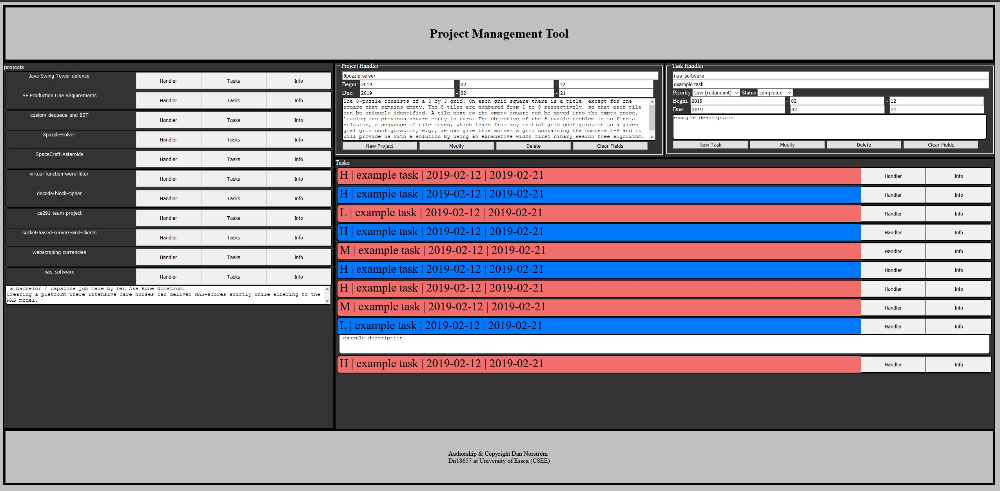

## project-management-tool

I've dockerized a old project to practice moving applications into containers. Task management tool made with PHP, javaScript, html/css utilizing certain ajax methodologies (except for error messages)

## build & run
requires docker, I recommend using Docker Desktop to clear old images.
Build safely while in repo: docker-compose up --force-recreate --build -d

The Mysql DB container takes a few seconds longer than the apashe 7.4 container to initialise.
